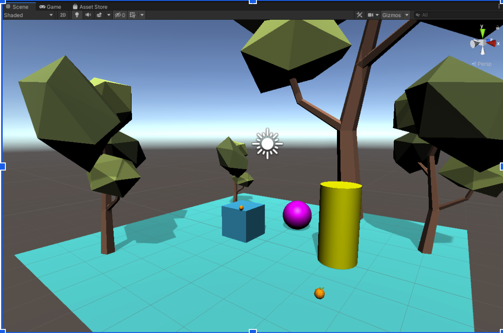

# assignment 01
VR class assignment 1, getting familiar with Unity

---

## 1. Goals 
1. Setting up a Unity project
2. Importing assets
3. Creating and manipulating GameObjects
4. Creating and applying materials
5. Adding/Importing 3D models

---

## 2. Outcome

---

## 3. Directions:
1. Download the Assignment_01.unitypackage unity package from GitHub or Team Drive
2. On a local resource, create a Unity Project named: Unity-VR 
Import package Assignment_01.unitypackage by:
Double-clicking on it
Top menu Assets > Import Package > Custom Package
3. Design an environment by using Unity’s Game Object > 3D Object
	4. Create a Cube, Sphere, Capsule, Plane, and/or Cylinder
	5. Create and apply new materials for the objects in your scene
4. Drag a few models into the scene from Assets/Models
Saving your scene
> From File > Save as... Assets/CourseMaterials/_Scenes/Assignment_01_LastName-v1
6. Practice navigating the scene
	7. 	RMB + drag = look around 
	8. 	RM + WASD = move around
	9. RMB + QE (or hold scroll + move)
7. Submit your work [See note below]

---

## 4.Submit

First Header  | Second Header
------------- | -------------
Submit your work  | Take a screenshot of your Scene view and upload it to the Team Drive folder
         | Assignments/Assignment1/Assignment01_LastName-v1.png.

> BONUS: It is possible to use version-control software like Github to track and evaluate projects
> You can share your GitHub repo with me by sharing the url in Slack’s channel assignments 

---

## 5. Potential Resources
1. [Unity Interface Guide](https://drive.google.com/file/d/1msQ8NN1AIsXw7ZOvzqzvkcPZsejBCzUr/view?usp=sharing) (PDF 240 KB)
2. [Navigation in the Unity Editor](https://learn.unity.com/tutorial/navigation-in-the-editor-2019?start=true#5d9b6e7aedbc2a67205d3f66) (10 min)
	3. Lynda tutorial: [Unity 3D 2021 Essential Training ](https://www.linkedin.com/learning/unity-3d-2021-essential-training/project-setup-overview?autoplay=true&resume=false&u=2219506)
		* Setting up the Unity Project (9 min)
		* Understanding the Unity Interface (~14 min ) 
3. [Unity Official Tutorials](https://www.youtube.com/watch?v=D7v2pjke5sc) (5 min)
